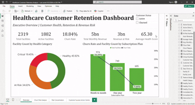

# Healthcare-Customer-Retention-Analysis
Predicting hospital churn before it happens, for a fictional healthcare SaaS provider operating in Lagos State, Nigeria - it is a self-directed project.

Developed a Power BI customer retention solution that assessed 2,319 healthcare facilities using a rule-based customer health score, identifying churn patterns, revenue at risk, product adoption gaps and intervention priorities to support data-driven Customer Success decision-making.

## Dashboard Preview

## Introduction
Primera Health provides SaaS platform infrastructure to hospitals and clinics across Nigeria, including hundreds of public and private facilities across Lagos State — from large teaching hospitals to small primary health centres. This project analyses facility-level subscription and engagement data to help the business understand which customers are healthy, which are quietly disengaging, and where churn is concentrated: before a facility cancels rather than after. 

## Problem Statement
Primera Health's Customer Success team had no reliable way to tell which subscribed hospitals were at risk of churning until after they had already stopped using the platform. Churn was only visible in hindsight, once revenue had already been lost. 

This project answers:

"How can Primera Health identify hospitals that are at risk of churning before they stop using the platform?"

Specifically, it aims to answer:

- Which currently active facilities show early warning signs of disengagement?
- What factors actually predict churn (plan type, facility size, ownership, geography)?
- How much revenue is currently exposed, and where should outreach be prioritized? 

## Data Sourcing 
- Base structure: This project uses a publicly available IBM Telco Customer Churn sample dataset, that has been adapted into a simulated healthcare SaaS context for analytical and portfolio purposes. The healthcare-specific variables and business scenario are synthetic and do not represent actual Primera Health data.
- Facility counts: sourced from the Lagos State Ministry of Health (2025, secondary facility count) and a peer-reviewed HEFAMAA-derived facility count study (Adeloye et al., Journal of Multidisciplinary Healthcare, 2023), cross-checked against a third independent source.
- Records: 2,319 facilities, reflecting Lagos State's actual public/private and tertiary/secondary/primary facility mix; not an arbitrary row count.
- Key fields: Facility ID, LGA, Ownership Type, Facility Level, Subscription Plan, Monthly Subscription Fee, Total Staff Licensed, Active Doctors/Nurses/Other Staff, Feature Adoption (%), Days Since Last Login, Customer Health Score, Health Category, Customer Status, Churn Reason, Customer Lifetime Value.
- Naming integrity: Facilities use systematic, clearly labeled generic identifiers rather than invented names.

## Data Transformation & Cleaning 
- Removing all fields irrelevant to a B2B healthcare SaaS context (customer demographics, US-specific geography, telecom product features).
- Replacing US ZIP/Lat-Long geography with Lagos State's 20 Local Government Areas (LGAs).
- Renaming and repurposing telecom fields into healthcare-SaaS equivalents (e.g. Contract → Subscription Plan, Monthly Charges → Monthly Subscription Fee, converted to Naira).
- Reducing row count from 7,043 to 2,319 to match Lagos State's actual facility population.
- Rebuilding engagement metrics so they are internally consistent: 
     - Active Users is a formula equal to Active Doctors + Active Nurses + Active Other Staff, so it can never be smaller than its own components.
     - Feature Adoption (%) is capped at 100% by construction, since active staff can never exceed licensed staff.
     - Health Category is derived directly from Customer Health Score via formula, so the two can never contradict each other.
     - Customer Status (Active/Churned) is generated as an outcome of health score and subscription plan, so churn rate, active-facility count, and revenue-at-risk stay proportionate to one another.
- Adding an Intervention Priority column, mapping Health Category into Customer-Success-facing labels (Critical → Immediate Attention, At Risk → Monitor & Engage, Healthy → Healthy).

## Data Modelling 
The model uses a single fact table (Facility Data) at the facility grain, with no separate dimension tables required, each row already represents one hospital/facility, and categorical fields (LGA, Ownership Type, Facility Level, Subscription Plan, Health Category, Intervention Priority) serve as the slicing dimensions directly within that table.

## Analysis & Measures
Key DAX Measures built for this project: 

### 1. Total Facilities  
```sql
DISTINCTCOUNT(Facilities_Data[Facility ID])
```

### 2. Active Facilities 
```sql
CALCULATE([Total Facilities], Facilities_Data[Customer Status] = "Active")
```

### 3. Churn Rate
```sql 
DIVIDE([Churned Facilities],[Total Facilities], 0) 
```

### 4. Total Monthly Revenue
```sql
SUM(Facilities_Data[Total Revenue to Date (NGN)])
```

### 5. Revenue at Risk 
```sql
CALCULATE([Total Monthly Revenue], Facilities_Data[Health Category] IN {"At Risk", "Critical"}) 
```

### 6. Active Critical Facilities
```sql
CALCULATE(DISTINCTCOUNT(Facilities_Data[Facility ID]), 
Facilities_Data[Customer Status] = "Active", 
Facilities_Data[Health Category] = "Critical")
```

### 7. Active Critical MRR 
```sql
CALCULATE(SUM(Facilities_Data[Monthly Subscription Fee (NGN)]), 
Facilities_Data[Customer Status] = "Active", Facilities_Data[Health Category] = "Critical")
```
## Dashboard & Visuals
The report is structured as a four-page decision funnel; from headline exposure, to diagnosis, to root cause, to action. Every visual is titled as the question it answers, not the mechanic behind it:
### Page 1 - Executive Overview
!

KPI cards (Total Facilities, Active Facilities, Churn Rate, Revenue at Risk, Avg Health Score), health category breakdown, churn by subscription plan.

### Page 2 - Early-warning Diagnostics
!
- Which Active Facilities Are Quietly Disengaging? Scatter plot showing Days Since Last Login vs. Feature Adoption (%), sized by revenue, filtered to active facilities only.
- Who Should Customer Success Call First? Health-Score-ranked table with heat-map formatting.
- How Many Healthy-Looking Accounts Are Actually in Trouble? Active + Critical facility count and MRR callouts.

### Page 3 - Where Risk Concentrates
!
- Are Smaller Facilities Harder to Retain? We looked at churn rate by facility level.
- Do Public or Private Facilities Churn More? We looked at churn rate by ownership type.
- Where in Lagos Is Churn Concentrated? Top 10 LGAs with the highest churn rate.
- What Actually Drives a Facility to Churn? Key Influencers AI visual.

### Page 4 - Customer Success Action Centre
!
- How Many Facilities Need Attention Right Now and What's at Stake? Using triage cards by Intervention Priority tier, with count and MRR each.
- Who Gets the Call This Week? Filtered, sortable outreach table.
- What Do At-Risk Facilities Have in Common? Decomposition tree showing Active + Critical facilities by level, ownership, and plan.

## Insights & Findings
- 81.2% of facilities are Active; the remaining 18.8% (437 facilities) have already churned.
- 26.4% churn rate on month-to-month plans, vs. 18.2% on one-year and just 7.4% on two-year plans, goes to say contract length is the single strongest churn lever.
- 20.5% of Primary-level facilities churn, vs. 15.4% of Secondary and 0% of Tertiary shows that smaller facilities are consistently harder to retain.
- 169 facilities are Active but already Critical, representing ₦17,457,000 in monthly recurring revenue. This is currently invisible to a churn-rate-only view.
- Ownership type (public vs. private) shows almost no difference in churn (18.5% vs. 18.9%), ruling out procurement structure as a meaningful driver.

## Recommendations
- Route the 169 Active + Critical facilities (₦17.5M MRR) to Customer Success immediately, they are still paying, which is the window to intervene.
- Incentivize migration off month-to-month plans, where churn runs roughly 1.97x higher than on two-year contracts.
- Build a lighter-touch onboarding path for Primary facilities, where smaller teams and lower feature adoption track with higher churn.
- Use the Days-Since-Login + Feature-Adoption scatter as a recurring weekly check to catch disengagement before the health score fully collapses.

## Tools 
Power BI · DAX · Power Query · Excel

# Conclusion

This project delivered a proactive, revenue-weighted view of hospital churn risk for a healthcare SaaS provider, shifting the Customer Success workflow from reacting to churn after it happens, to flagging at-risk facilities while there is still time to intervene. The four-page dashboard gives stakeholders a segmented view of exposure and Customer Success a literal, ranked outreach list rather than a static report.

Future work could explore whether stated churn reasons corroborate the statistically identified churn drivers: for example, testing whether facilities that cited cost-related reasons (price increases, budget constraints) disproportionately fall within the subscription plans already flagged as high-risk. This was considered during the build but set aside, since Churn Reason is only available for already-churned facilities and cannot be used to diagnose currently active ones without risking overstated conclusions from a self-reported, historical field.

Also, it could include building an actual predictive churn model (logistic regression or similar) using this same feature set, and layering in real usage-log timestamps rather than snapshot metrics for continuous monitoring.


